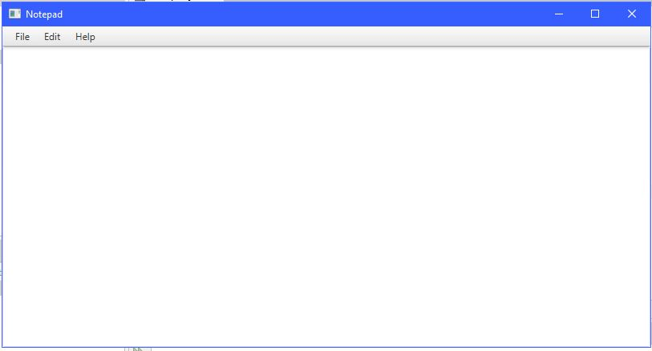
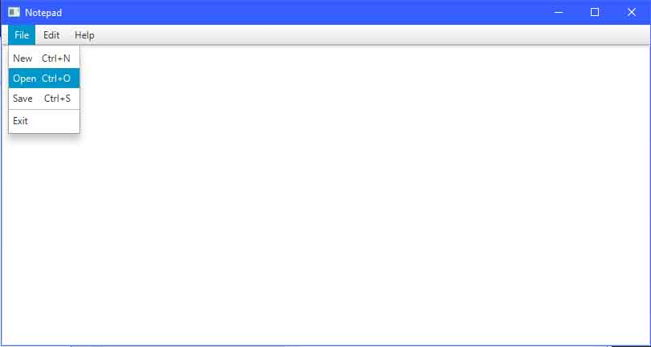
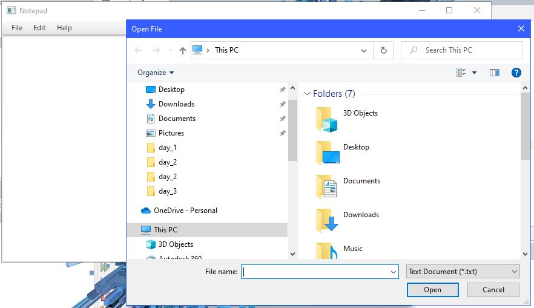
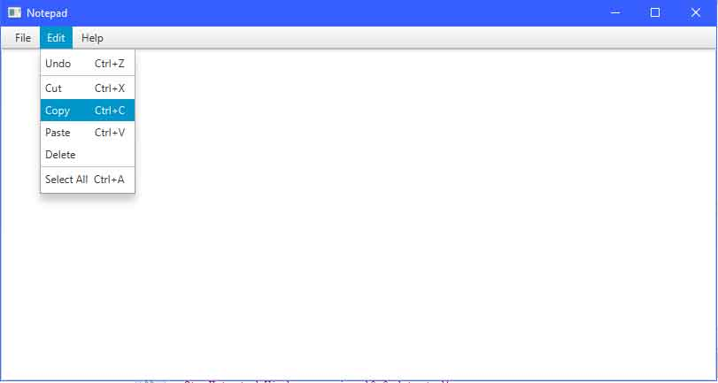
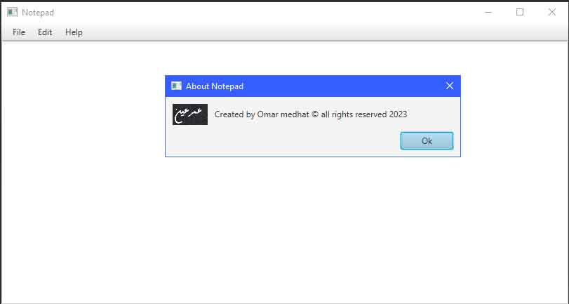

# Notepad Clone using java
## Run Locally

Clone the project (jdk 19)
 
```bash
  git clone https://github.com/Omar3ain/NotePad_app_using_java.git
```

Go to the project directory

```bash
  cd my-project 
```
Compile and run the application
## Screenshots





